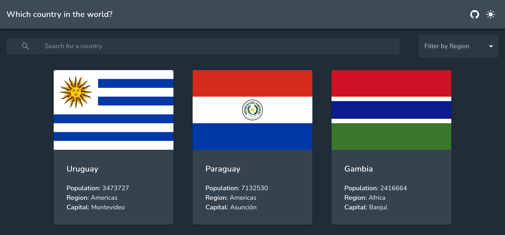

# Country Flags

A simple app to learn about some general information of the all the countries in the world.



## How To Use

```bash
git clone https://github.com/tomwf/country-flags.git
```
Navigate into the directory:
```bash
cd country-flags
```
Install the dependencies:
```bash
npm i
```
Run the local dev environment:
```bash
npm run dev
```
Open your browser and visit:
```
http://localhost:5000
```

## Link

Live Demo: [Country flags](https://tomwf-country-flags.herokuapp.com/)
